```{r setup, include = FALSE}
library(tidyverse)
library(mosaic)
library(mdsr)
library(knitr)
library(kableExtra)
library(googleCloudStorageR)
library(cloudml)
library(tensorflow)
library(reticulate) 
library(tfdatasets)
library(keras)
library(tidyverse)
library(ggplot2)
library(tfruns)
```

```{r sample-fig1, echo=FALSE, fig.align="center", out.width = "75%", out.height = "25%", fig.cap="Big Data in Healthcare"}
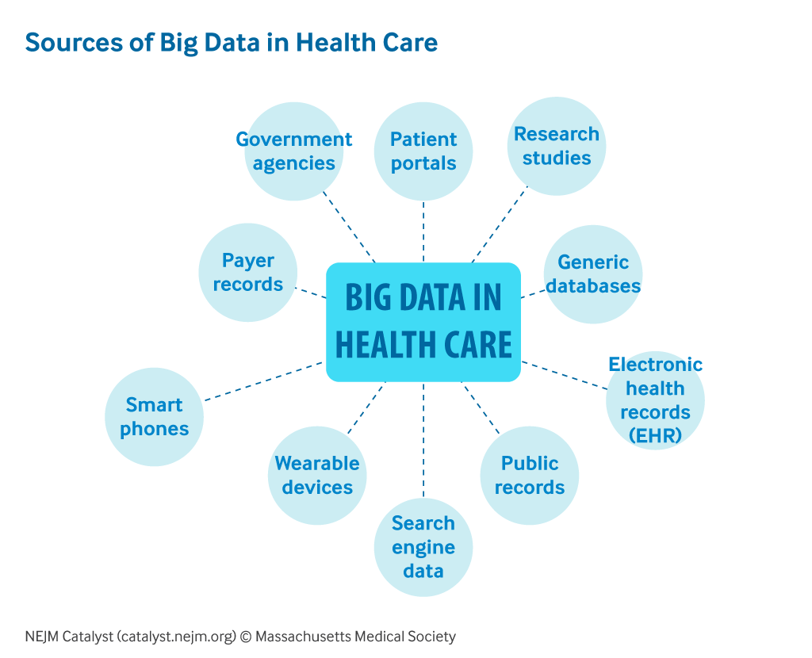
```

# Introduction

|      It has been estimated that roughly 80% of health care data is unstructured data, which can come in the form of videos, sensor data, images, or text. Although hospitals and researchers used to have a hard time extracting insights from this type of data, with the recent advances that have been made in data science and handling big data, this has created new application areas within the health care industry in sectors such as genomics, drug trials, predicting patient health, and medical imagery (See Figure 1 @NEJM). Medical imaging research in particular has made significant progress recently with researchers being able to use different machine learning algorithms to detect different types of lesions and cancers from CT and other types of scans. In particular the advancements of convolutional neural networks to identify whether or not someone has pneumonia has become extremely promising and can be used to potentially help doctors identify whether or not someone has pneumonia that they might have missed, and reduce the amount of hours and amount of expertise required to view CT scans. 

When working with medical imagery data sets one of the first problems someone may run into is how to process and handle these large data sets. When trying to perform analysis on small and medium sized data sets within R, one rarely run into complications that would be attributed to how R is loading and dealing with the data itself. But what happens when one moves from the world of medium sized data to the world of Big Data and large data sets? While most of the time one can load data into the R Studio environment without issues and without having to worry about whether the entirety of our data can even be loaded in, one may begin to run into complications the larger the data set becomes. If one ends up crossing into the threshold where R can no longer store all the data in an effective way, there are multiple potential solutions in the forms of choosing random subsets of the data, buying a computer with larger memory, or use parallelization and using multiple clusters to perform the analysis. It is this solution of choosing random subsets of data, using the Keras and Tensorflow R packages, that will allow me to work with and convert large files of image data into a form that models can be trained on them.

On top of the issue of trying to run analysis on large data sets in R itself, is the issue of how to best store and load the original information and data. Often data sets are small enough that they can be stored on your local computer in a folder that is then uploaded into the R Studio Environment itself, but what should one do as the size of the data set substantially increases and one no longer wants to store large data sets directly on their machine. One solution to this problem is to take advantage of a cloud computing service and store the data directly in the cloud, freeing up space and memory on your personal computer. By storing the data on a cloud computing service, this becomes especially useful when a project begins to get scaled up whether that is through adding new members to work on the project or when more and more data gets added to the project. In this project I will take advantage of Google Cloud Storage to store my data, saving space on my local machine.

By combining Google Cloud Storage with Keras and Tensorflow, this will allow me to utilize a large data medcical imagery data set that is made up of CT scans. This data set will then be used to train and create convolutional neural networks that will try to identify whether or not someone has pneumonia from the images. 
	
This project will allow me to answer the questions of what is the best way to store large data sets and perform computationally expensive analysis on those data sets? How does one handle and process images so that analysis can be performed on them, and how effective are convolutional neural networks at identifying pneumonia within CT scans?  

# Google Cloud Storage 

|      When trying to work with Big Data, one of the first questions one has to answer is what is the best way to store and access this data. While smaller files can be stored directly on your computer and eventually loaded into R Studio to perform analysis on, when data moves into the gigabyte, terabyte, or even petabyte range one may not not want to store this data directly on their machine and use of large chunks of their limited memory that is available. With the advancement of cloud service solutions in recent years though, one can now use a platform such as Google Cloud Platform, Amazon Web Services, or Microsoft Azure, to store large amounts of data directly on these platforms and take advantage of these companies large data warehouses for a small cost. This can allow one to free up space and memory on their own personal machine and access the data directly from these servers whenever they desire.

```{r sample-fig2, echo=FALSE, fig.align="center", out.width = "75%", out.height = "25%", fig.cap="Google Cloud Storage Platform"}
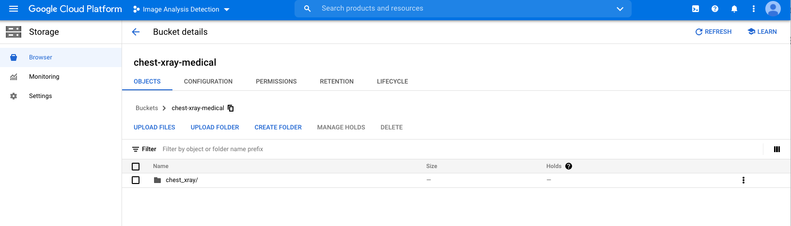
```

For this project, I am going to focus on how to setup and store medical imagery in Google Cloud Storage and learn how this can be connected to R Studio so that I can then perform analysis on these images. The data set I will be working with is a labeled Chest X-Ray images (@Medical) which will be used to detect and classify whether or not someone has pneumonia. This data set is roughly 2 GB in size and contains CT scans of patients who either have or dont have pneumonia. Due to Github having maximum storage limit of 1 GB, I wanted to look into ways that would allow me to work with a data set of this size and not have to upload the data directly into Github itself. One of the solutions for this was to use Google Cloud Storage and take advantage of the free credits that Google offers for new users using their service. By uploading and storing the data set directly onto the Google platform, this meant I could delete the data set off my computer for the time being and free up memory space (See Figure 2 for an example of the Google Cloud Platform Console).

In order to actually work with this data in R Studio though, a connection between R and Google Cloud was required to be setup. By utilizing the *googleCloudStorageR* package, I was able to setup a connection that allowed me to download the data from my Cloud Storage bucket and onto my desktop where it could then be read into R Studio without having to store the files themselves within R Studio (@GoogleyR). This allowed me to not have to store the data in my actual Github repository but still be able to perform analysis and build models on the image dataset.

# Image Transformation and Tensorflow

|      Once the images are in a place where they could be loaded into R, one needs to put the images into a format where R can actually perform analysis on them. For images, this means making it so they all have the same underlying which can require  different image transformations and adjustments such as cropping, brightness, contrasting, changing the color scale, or resizing an image. This sort of data augmentation, when performed on all the images in the data set can help create a more consistent form between all the images. For the images in my medical imagery data set,this primarily consisted of resizing the images on a pixel by pixel basis so they were all the same size, and then converted them to a grayscale color. This made the underlying structure of the images the same for all the images in the data set. See the Figure 3 for an example of two patients, with and without pneumonia after adjustments were made. 
```{r sample-fig3, echo=FALSE, out.width = "49%", fig.show='hold',out.height="25%",fig.cap="Patient CT Scans. At left, patient with pneumonia. At right, a patient without pnuemonia"}
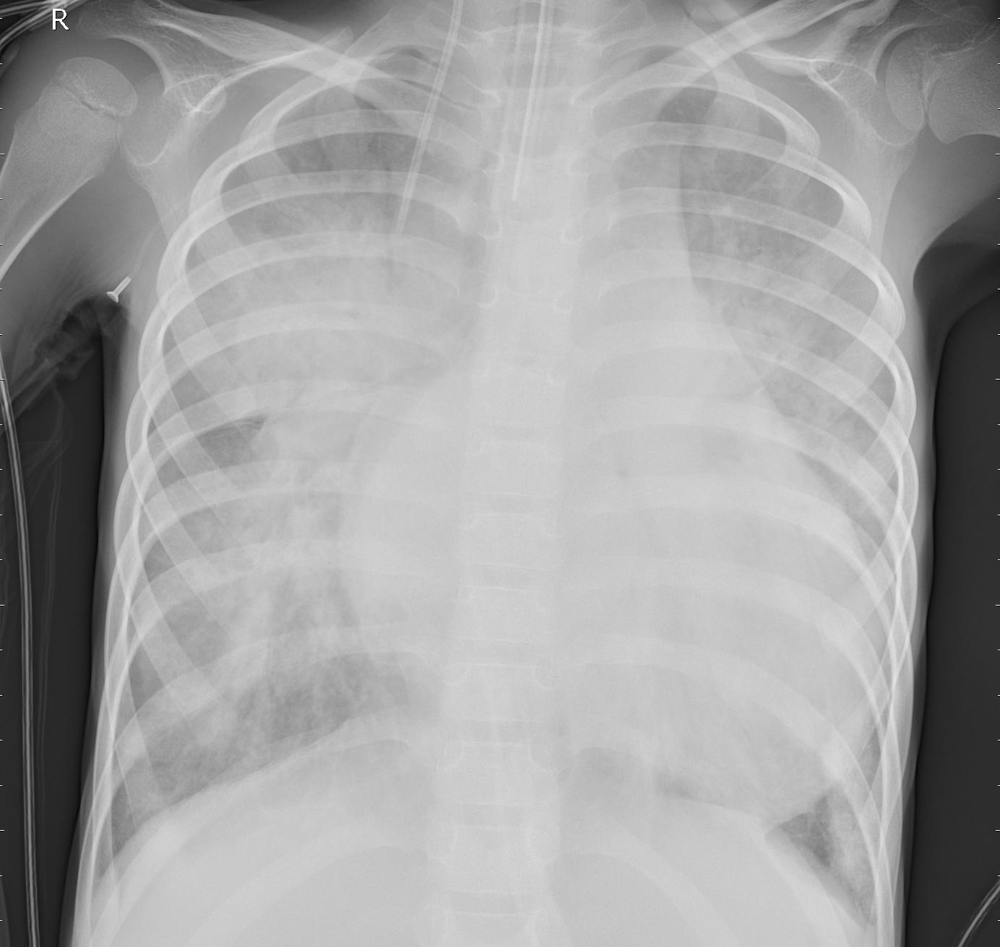
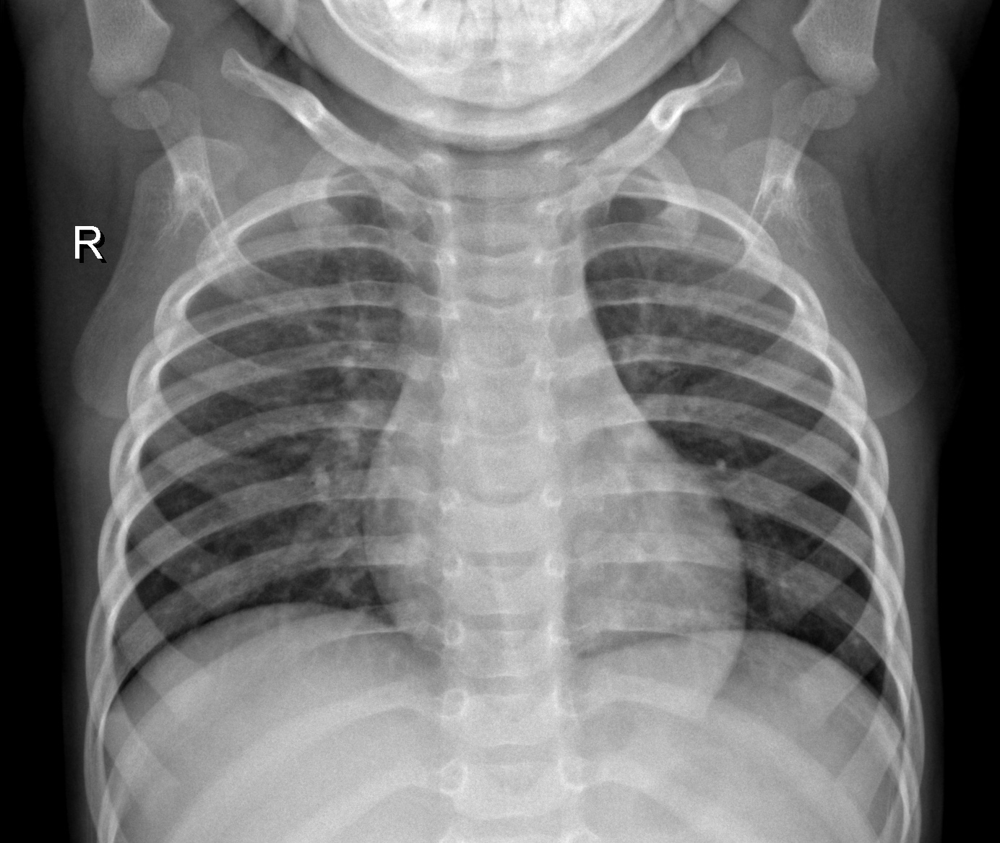
``` 
After getting all the images into the same structure, I needed to convert them to a form where I could actually perform analysis on the images. In order to do this I relied on the *tensorflow* R package @Tensorflow2. Tensorflow is a “scalable and multiplatform programming interface for implementing and running machine learning algorithms” @PML. Tensorflow allows execution on both CPU’s and GPU’s which help speed up processing time on complicated algorithms. This package is built around a “computation graph composed as a set of nodes where each node represents an operation that may have zero or more input or output. A tensor is created as a symbolic handle to refer to the input and output of these operations” @PML. A tensor is best understood as either a scalar, vector , matrices and so on, which all correspond to a different rank tensors (See Figure 4 @PML). These tensors are created from the values in the data you are working with and then are used to build and create the complex models one wants to work with. 

```{r sample-fig4, echo=FALSE, fig.align="center", out.width = "75%", out.height = "25%", fig.cap="Tensors in Tensorflow"}
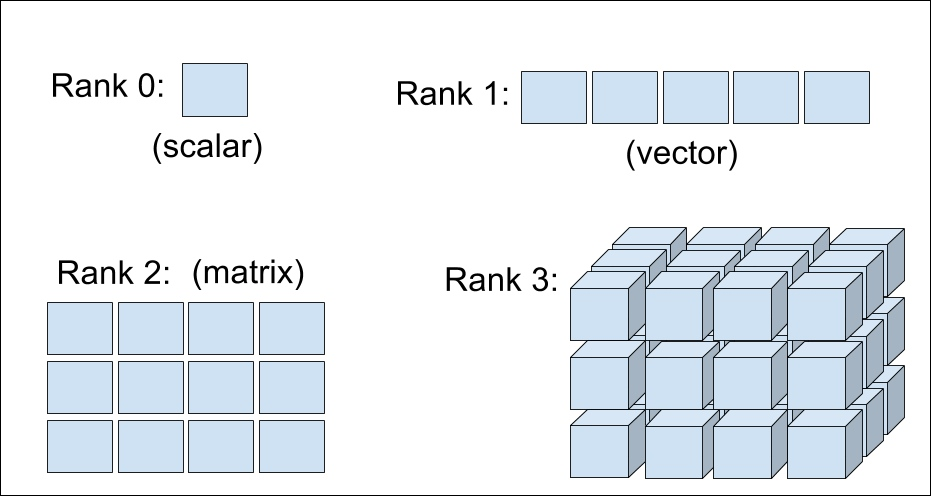
```
For the images in my data set, by using Tensorflow I was able to convert the images into a set of tensors that represented the pixels of the images themselves. Since the images had been resized to a 64x64 pixel picture in grayscale coloring, this became a 64x64x1 tensor, or Rank 3 tensor, for each image. These tensors were then combined with their appropriate label for the type of image they were, either Normal or Pneumonia, creating a nicely formatted data set where we could then start to create models to best classify the data.   


# Keras and Convolutional Neural Networks

|      As we could see from the prior pictures of someone who had pneumonia versus someone who did not have pneumonia, it can be very hard to discern whether or not someone has pneumonia for a person without the technical training and expertise to identify pictures of pneumonia from looking at the CT scans. This ultimately requires doctors and those with the expertise to spend more time looking at the scans, rather than spending their already limited time directly helping patients. One way to help doctors to get back to directly helping patients is by utilizing machine learning to identify and detect different diseases or ailments within CT scans. By training and creating models that are able to discern between a normal or healthy scan versus someone who has a lesion or has pneumonia, we can begin to use artificial intelligence to alleviate some of the extraneous work that doctors are required to do.

## Keras 
|      For this project, I was specifically focused on creating a model that would would be able to discern between someone who has pneumonia versus someone who does not have pneumonia. In order to do this I utilized the *keras* package in order to build a convolutional neural network to be able to distinguish between the two different diagnosis @Keras2. Keras is a "high-level neural network API that is built to run off other libraries such as Tensorflow to provide a user-friendly interface to building complex models" @PML. Keras, when working with Tensorflow, helps to provide the framework to begin building complex neural network models. This package will allow me to be able to not only train and build the model, but be able to test the model on another subset of images and be able to begin to predict whether or not someone has pneumonia from looking at a specific image. Specifically I used the keras package to build out a convolutional neural network that have been shown to work extremely well for image classification tasks. 


## Neural Networks

|      Convolutional Neural Networks (CNN) at a high level are a form of deep learning that takes an image as an input and eventually classifies it under a certain category. These types of networks are used heavily to perform tasks such as facial recognition, object detection, and image classification to just list a few. CNN's are a specific type of neural network, which falls under a branch of machine learning called deep learning. Neural networks are extremely popular today due to recent advances in both the algorithms used to build the models as well as the computer architecture which allows for much faster processing times of these complex models.

The figure above shows an example of what the underlying structure of a neural network looks like (See Figure 4 @Investopedia). The neural network show in this example consists of one input layer, one hidden layer with 4 hidden units, and then one output layer. The input layer would be the exact data you are feeding into the model, so for this picture this would mean there was two examples being fed into network to train the model. Then we can see how each of the input layers are connected to three of the gray nodes in the hidden layer. While this model only has one hidden layer and the inputs are only connected to 3 of the hidden units, in other models one could create multiple hidden layers, each with a different number of hidden units, and the number of units that are connected together from layer to layer can vary as well. After that we can see that there is one output layer for this example, but other networks can contain varying numbers of output units as well. Neural networks in general can contain differing number of hidden layers, hidden units, input and output units which will all depend based on the data they have and the problem one is trying to solve. In general, data is fed into the model, it is passed through the network using weights, and then often trained using a technique called backwards propagation. This technique is able to optimize the model by comparing the result found by the model to the true results, and then working backwards through the model to update the weights so that the model can better classify the input data. Neural networks in general have been shown to be extremely successful at a broad range of tasks such as natural language processing or self-driving cars. 
```{r sample-fig5, echo=FALSE, fig.align="center", out.width = "75%", out.height = "25%", fig.cap="Neural Network example"}
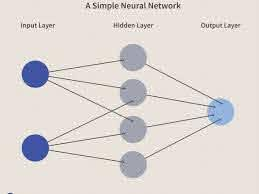
```

## Convolutional Neural Networks (CNN)

|      As previously mentioned, CNN's a specific form of Neural Network that is based heavily on how the visual cortext of the human brain works when recogizing images, which is what allows it to perform extremely well on image classification tasks. At a high level CNN's work by "combining the low level features in a layer-wise fashion to form high-level features" @PML. So rather than just looking at each pixel of an image separately, this model works to combine pixels into distinct features that can then be used to identify exact objects within the images. In order for the model to actual identify distinct features it relies on an idea called feature mapping that groups patches of pixels together in the image and combines them into one feature in the new feature map. This is based on the underlying assumption that in the context of image data, "nearby pixels are typically more relevant to each other than pixels that are far away from each other" @PML. 

In order to actually perform this feature mapping though a CNN relies on creating a series of different types of layers in the form of convolution layers, subsampling layers, pooling layers, and dropout layers.

### Convolution layers
|      Convolution layers is one of the first layers that begins extracting features from the input images. This layer works by taking an input matrix that represents the image and a filter matrix, of potentially a different size, with a set of weights. These two matrices are multiplied together to create a feature map that begins to identify the low level features such as edges, blurriness, or sharpness of the image. 

### Subsampling and Pooling Layers
|      Another type of key layer is the subsampling and pooling layers. Usually the feature map that is created from the previous convolution layer is then fed into a subsampling/pooling layer. These layers work by combining small subsections of the feature map in order to simplify the feature map. The advantages of this include leading to higher computational efficiency by decreasing the size of the features and the number of parameters that are required to learn, as well as introducing local invariance that helps to generate feature that are more robust to noise from the input images @Mathworks.

### Dropout layers 
|      Dropout layers are then used to prevent over-fitting of the data set. It can be very easy to create a CNN that gets over-trained but then fails to perform well on the testing set of data. To prevent over-fitting and make the model work well for a broader range of images for general performance, dropout layers are introduced as a form of regularization. Dropout is usually applied to hidden units of layers and works by "during the training phase of a neural network, a fraction of the hidden units are randomly dropped at every iteration. This dropping out of random units requires the remaining units to rescale to account for the missing units which forces the network to learn a redundant representation of the data" @PML. This makes it so the model is more generalizable and robust to changes in patterns in the data and prevent over-fitting. 

### Challenges

|      When working with CNN's, these different types of layers that the network can be built off can all be included multiple times and in different orders. For example one could create a network of just a convolution layer and a dropout layer or someone could create a model that is convolution layer, pooling layer, convolution layer, and then two dropout layers. There is no set rules around what order or how many different layers your network can have. On top of having unlimited variations of the type of layers within the network, there is also unlimited parameters that one can choose in terms of the size of the feature map, the number of units to pool together in the pooling layer, or the number of units to dropout in the dropout layer to just list a few examples. Due to having so many input parameters that can be changed and altered when it comes to building the model, finding the best possible input parameters and underlying structure of the model can become computationally expensive very quickly. 

|      On top of CNN's being very computationally expensive to run, being able to interpret the outputs and inputs of individual layers of the network is its own separate issue. Often these types of models are referred to as "black box" models because while a human can understand the input and outputs of the models, it is often hard to decipher and understand what exactly the model is doing inside the box. While there has been promising developments in this area such as Visualizing Activation Layers  and Occlusion Sensitivity, this still remains an area of the field that a lot of future work can be done in @Deep. While CNN's have been shown to do an incredible job at image classification tasks, optimizing and understanding these types of models is an area that can cause problems and issues. 

## CNN's with Medical Images

|      For my project, I wanted to use Convolutional Neural Networks to see how well this type of network could perform on the task of trying to classify whether or not someone had pneumonia based just of a CT scan. At this point I have already gotten my images into a form that allows them to be passed as inputs to build a model, so the next step was for me to begin training the model.
```{r, echo=FALSE}
chest_list <- c("NORMAL","PNEUMONIA")
output_n<-length(chest_list)

img_width <- 64
img_height <- 64
target_size <- c(img_width, img_height)

#this is for grayscale images
channels <- 1

batch_size<-32

# path to image folders
##comeback and change this
train_image_files_path <- file.path("medical_images/chest_xray/train")
```

```{r, message=FALSE, echo=FALSE}
train_data_gen = image_data_generator(
  rescale = 1/255,
  validation_split=0.2
)
```

```{r, echo=FALSE}
train_image_array_gen <- flow_images_from_directory(train_image_files_path, 
                                          train_data_gen,
                                          subset = 'training',
                                          target_size = target_size,
                                          color_mode="grayscale",
                                          class_mode = "binary",
                                          classes = chest_list,
                                          shuffle=TRUE,
                                          batch_size=batch_size,
                                          seed = 27)

val_image_array_gen <- flow_images_from_directory(train_image_files_path, 
                                          train_data_gen,
                                          subset = 'validation',
                                          color_mode="grayscale",
                                          target_size = target_size,
                                          class_mode = "binary",
                                          classes = chest_list,
                                          shuffle=TRUE,
                                          batch_size=batch_size,
                                          seed = 27)
```

To begin training the model I started off by first splitting my data into training, validation, and testing sets. The training set would be used to train the model, the validation set would be used to tune the parameters in the network, and then the test set would then be used to assess the performance of the final model and see how generalizable the results are when given separate input images.

After splitting up the data into their different sets I found that overall the data set contained many more pictures of people than pneumonia than people who did not have pneumonia. In fact, the training data contains 74% picture of people with pneumonia and 26% being normal images. 

```{r, out.height="40%", out.width="50%", echo=FALSE, eval=FALSE}
tb<-tribble(
  ~Type, ~Count,
  "Normal",1073,
  "Pneumonia",3100
)

count<-ggplot(data=tb, aes(x=Type, y=Count)) +
  geom_bar(stat="identity", color="blue", fill=rgb(0.1,0.4,0.5,0.7) ) + ggtitle("Count of Different Image Types in Training Set")
count
```

What this tells us is that if a random person were to guess that every picture was a picture of pneumonia, that they would be correct 74% of the time. So when I build out my models, I will be looking for a model that is able to achieve better than 74% accuracy to say it is an improvement over a baseline random guessing model. 

## Model 1
```{r sample-fig6, echo=FALSE, fig.align="center", out.width = "75%", out.height = "25%", fig.cap="Model 1 Summary"}
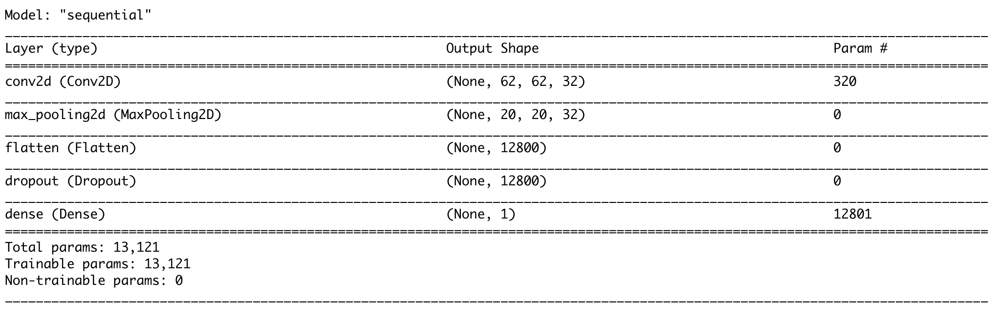
```

```{r sample-fig7, echo=FALSE, fig.align="center", out.width = "75%", out.height = "25%", fig.cap="Model 1 Accuracy"}
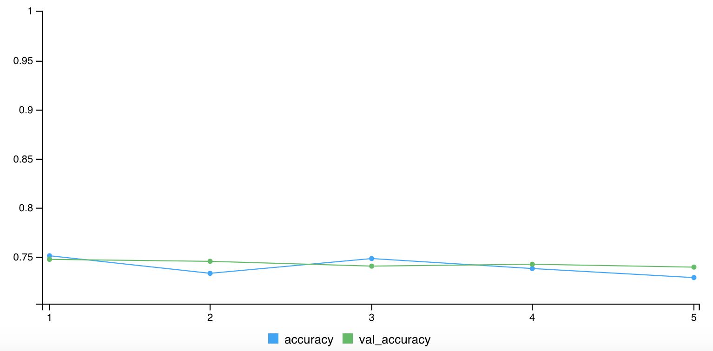
```

|      Now that I had an understanding of what my training set looked like, I wanted to try building my first convolutional neural network. For my first model I decided to build a model that had one convolution layer, one pooling layer, one flattening layer, a dropout layer that removed half of the available units available in the previous layer during each new training iteration, and then finally one dense layer. The flattening layer works to replace all dimensions of the previous tensors down to one dimension, which is the dimension size we want our output layer to be. The dropout layer is used to make the model more generalizable and requires the model to fit the units with only half the units of the previous layer available during any iteration. The final dense layer is used to create  a layer of units, in this case one unit, where every unit in this new layer is connected to every unit in the previous layer, making it densely connected. See Figure 6 for what this model looks likes. From looking at Figure 6 one can see that there are 13,121 trainable parameters. These are all the weights between the different layers that the model will try to optimize during each training run.

After training this model we can see  from looking at Figure 7 that although it starts at around being 75% accurate on both the training and validation sets, that even after 5 epochs that the model does not do any better at being able to discern between whether or not an image is normal or pneumonia than just random guessing. This suggests that either the model does not have enough layers to it and is not able to extract distinguishable features from the images or that there were not enough epochs to train the model. It is also worth noting that this model took 2 and a half minutes to complete its training, with roughly 30 seconds per epoch. This long run time is due to the large number of trainable parameters in the model.


## Model 2
```{r sample-fig8, echo=FALSE, fig.align="center", out.width = "75%", out.height = "25%", fig.cap="Model 2 Summary"}
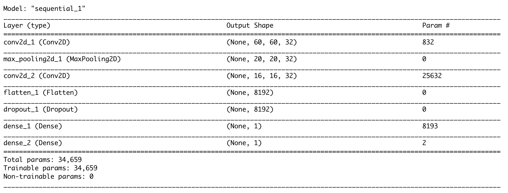
```

```{r sample-fig9, echo=FALSE, fig.align="center", out.width = "75%", out.height = "25%", fig.cap="Model 2 Accuracy"}
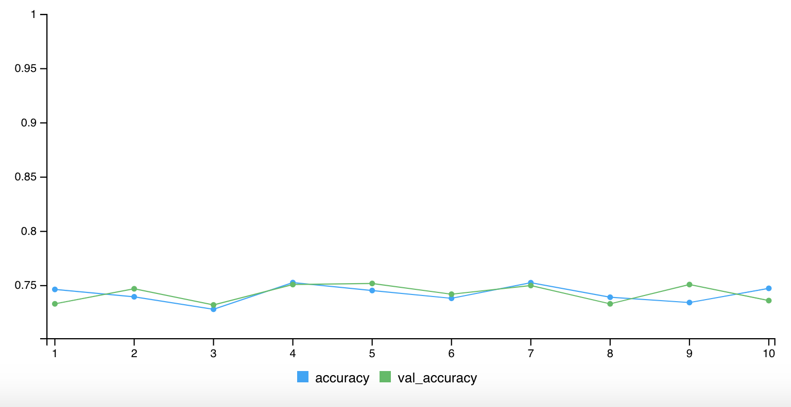
```
|      Since model 1 did not do any better than one would do than just randomly guessing, I decided to try to improve upon the first model by adding a second convolution layer after the first pooling layer, as well as a second dense layer at the end of the model. I also decided to increase the number of epochs from 5 to 10 to see if allowing the model a longer period of time to train itself would help improve the accuracy of the model at all. My hopes were that adding these new layers would help the model discover features in the images that it wasnt able to detect with the first model and adding more epochs would give the model more time to find these features. Figure 8 shows how the new model is constructed. We can see that by adding these two new layers to the model that there are now 34,659 parameters that the model is going to try to maximize during its training process. 

Even after adding a second convolution layer and a second dense layer at the end, we can see that this model again does not do any better than the previous model by looking at Figure 9. One can see that the accuracy stays right around 75% for both the training and validation sets, and that even after increasing the complexity of the model slightly and increasing the number of epochs that the model is still not any better than guessing Pneumonia every time. This model also took roughly 5 minutes to run with every epoch taking 30 seconds to run. 

## Model 3 

|      Since my second model still did not do much better than someone randomly guessing, for my third model I decided to increase the complexity of the model substantially. Since the previous models did not appear to be able to detect any distinguishable features from the images, by increasing the number of layers in the model I believe it should help the model finally be able to detect the underlying features. For this model I decided to have 4 pairs of convolution, pooling, and dropout layers, followed by a flattening layer and then two dense layers. As we can see from Figure 9, this model now has 98,017 trainable parameters that the model will try to optimize. 

As we can see from this output, the model is finally able to discern between images that contain pneumonia and normal images. As we can, over the course of 10 epochs the model is able to increase it accuracy from under 75% to close to 90% by the 10th epoch. From the graph we can also see that the validation accuracy score is always slightly under the training accuracy score, which suggests that the model might be slightly over-fitting the data, but because I already included 4 dropout layer in the model and the scores are still relatively close, this is not something to worry about too much. Now that I have found a model that is able to achieve close to 90% accuracy, I am going to move on and try this model on the testing set. This model also took close to 5 minutes to run even though the number of trainable parameters increased substantially.

```{r sample-fig10, echo=FALSE, fig.align="center", out.width = "75%", out.height = "25%", fig.cap="Model 3 Summary"}
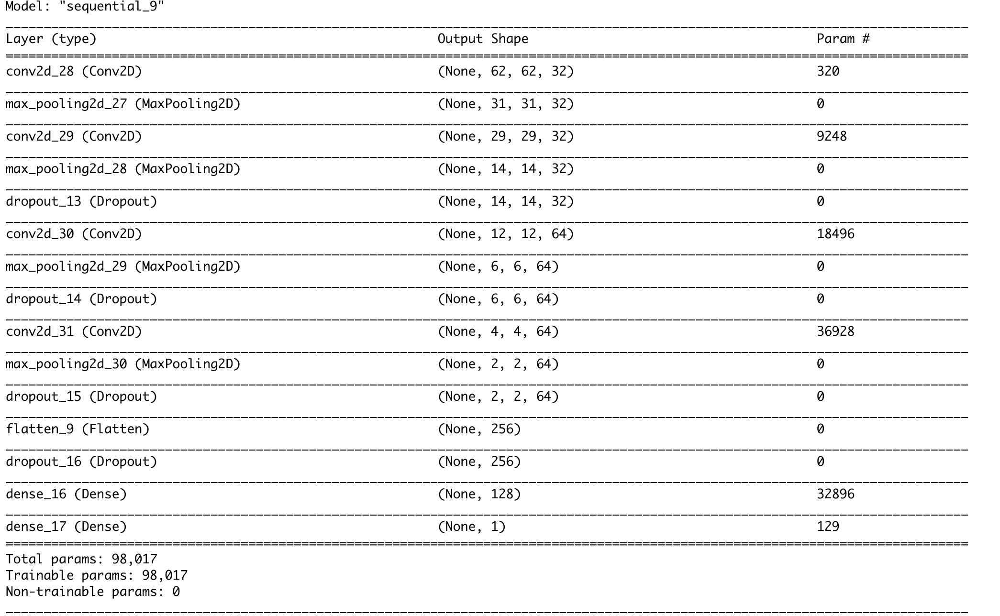
```

```{r sample-fig11, echo=FALSE, fig.align="center", out.width = "75%", out.height = "25%", fig.cap="Model 3 Accuracy"}
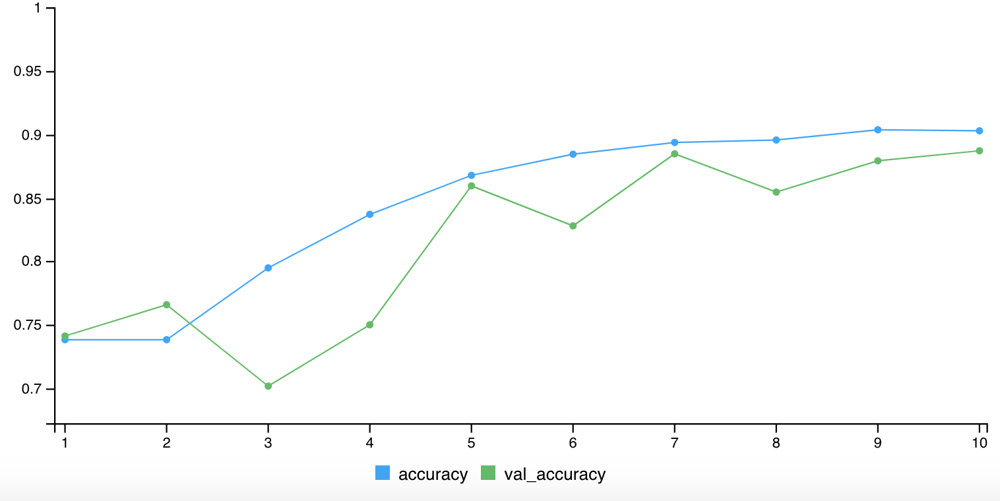
```

## Results

```{r, echo=FALSE}
model3 <- load_model_hdf5("setup/my_model3.h5")
```

```{r, echo=FALSE}
chest_list <- c("NORMAL","PNEUMONIA")
output_n<-length(chest_list)

img_width <- 64
img_height <- 64
target_size <- c(img_width, img_height)

#this is for grayscale images
channels <- 1

batch_size<-32
 test_image_files_path<-file.path("setup/medical_images/chest_xray/test")
```

```{r, echo=FALSE}
test_datagen <- image_data_generator(rescale = 1/255)

test_generator <- flow_images_from_directory(
        test_image_files_path,
        test_datagen,
        color_mode="grayscale",
        target_size = target_size,
        class_mode = "binary",
        classes = chest_list,
        batch_size = 1,
        shuffle = FALSE,
        seed = 42)
```

|      After running model 3 on the testing set, the model was able to achieve an accuracy score of 84.6% and a loss score of 0.381 . The testing set contained 234 normal images and 390 pneumonia images so if one were to guess pneumonia every time they would be correct 62.5% of the time. While ideally the model would be able to achieve a perfect 100% accuracy and 0 loss, being able to train a model that achieves an accuracy of 85% on a task as challenging as being able to identify whether or not someone has pneumonia is a very promising result.
<br />

```{r, warning=FALSE, message=FALSE, echo=FALSE}
set.seed(1)
test_results<- model3 %>%
  evaluate_generator(test_generator, 
                     steps = as.integer(test_generator$n)) 
test_results<-test_results %>% as_tibble()
knitr::kable(test_results)
```
<br />

When looking at Figure 12, we can break down the accuracy score further and look into how the model did at identifying the two different classes one can begin to look into areas where the model does very well and where the model struggles. By looking at the confusion matrix in Figure 12, we can see that the model does an extremely good job of identifying when the image is of someone who has pneumonia, being able to predict is correctly 96.7% of the time. We can also see that the model is only able to correctly predict whether someone is normal at a 66.2% of the time. What this output tells us is that the model is more likely to identify a patient as having pneumonia when they have do not have it, rather than the opposite scenario of telling a patient they do not have pneumonia when they in fact have it which is probably the more dangerous scenario. When thinking about why the model does such a better job at identifying patients who have pneumonia, it comes back to the type of data we used to train the model. Since the training and validation data contained 3x as many pictures of pneumonia, it makes sense that the model does a much better job of being able to recognize when someone has pneumonia. So while being able to achieve 85% accuracy with a convolutional neural network is very promising, these results show that there is future work that can be done that would be able to improve the model's accuracy even more. 

```{r sample-fig12, echo=FALSE, fig.align="center", out.width = "75%", out.height = "25%", fig.cap="Confusion Matrix of Testing Set Results"}
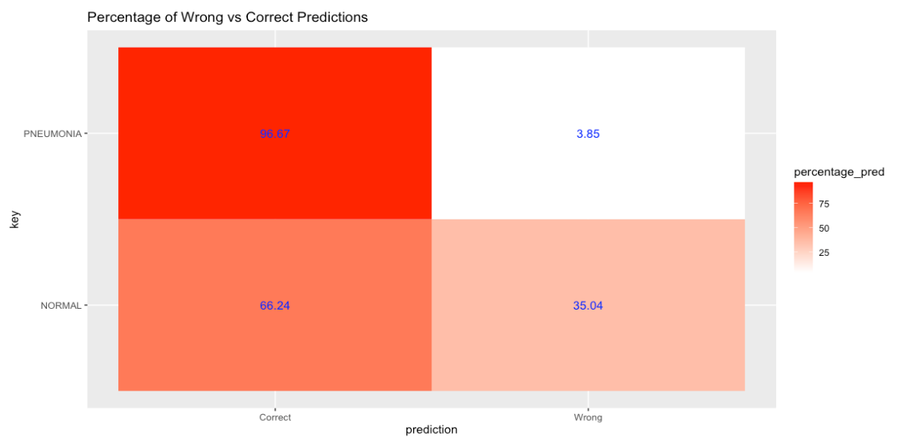
```

# Conclusion and Future Work

|      Through this project I was able to explore different ways of dealing with large data sets, learn how to transform images, and learn how to work with complex neural networks. In order to achieve my final goal of creating a model that successfully is able to detect whether or not someone has pneumonia from a CT scan, I first had to learn how to store a large data set with Google Cloud Storage and connect that with the R Studio environment. The next task involved having to learn how to convert images into a form that they could actually be used to train models using the Keras package was its own separate task, and finally had tp learn how convolutional neural networks worked in order to be able to train my own models with the data set highlighted how to work with large nontraditional data within the R Studio Environment. While I would have liked to achieve a higher accuracy score on my final model, this work shows how exciting this field of machine learning is and just began to scratch the surface of the different application areas of this type of model. 

When reflecting back and thinking about ways that this worked could be built on in the future, the first thing that comes to mind is learning how to use image augmentation techniques to build off the underlying images. Having a training set that contained a much higher percentage of patients with pneumonia than patients without pneumonia drastically affected the final model that was created. As one could see from the final confusion matrix the model did an incredible job correctly predicting when a patient had pneumonia but did poorly when predicting if a patient was normal. This is largely due to the training set that it was fed and is the first area that could be used to improve the model.

The second way this project could be improved upon in the future would have been to work entirely within the Google Cloud Environment. While it worked to store the data within the Cloud Environment, in order to work with RStudio on my desktop, this required having to download the data from the Cloud onto my desktop to perform analysis on the data. Since Google Cloud now offers an R Studio that runs directly within their cloud environment, this would have greatly improved the efficiency of this project. Not only would this have meant that the data never would have had to be downloaded onto my computer, but also could have taken advantage of the Google Cloud AI Platform. 

The Google Cloud AI Platform would have first helped by speeding up the run time of the models I created. As I mentioned in the report, running and training these models took upwards of 5 minutes each and this didn’t include any optimization techniques. Using the AI platform would have allowed me to speed up the training time and also try out different optimization methods that would have helped improve the accuracy of my model even further. So while overall this project was very successful in what I set out to learn, there are certainly still areas that could be improved upon in the future.


Note: Other sources that were extremely beneficial towards this project include @PAD, @Medium, @CloudStorage, @Kaggle, @RPubs,and @Shirin
\newpage